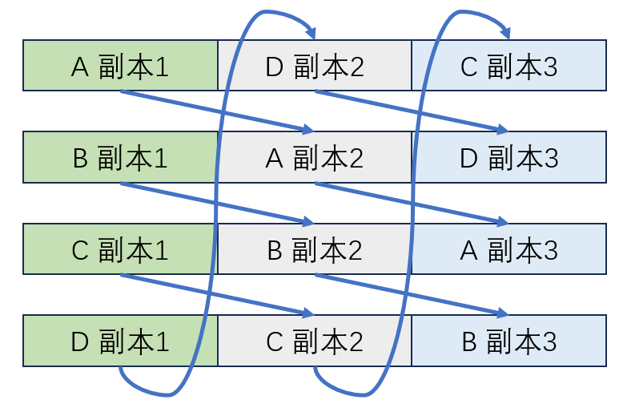

# CodeCraft2025 / [2025华为软件精英挑战赛](https://developer.huaweicloud.com/codecraft2025)

我们是来自江山赛区的“再吃一颗苹果”赛队，很高心能在今年的软挑斩获季军。下面记录我们本次比赛采取的策略和一些心得体会，希望对大家有所帮助。

## 1 解题策略

> **Simple is best.**

我们希望尽可能使用简单的策略去规避复杂的任务分配、块分数计算等问题。下面提到的方法均为核心策略，中间存在一些小trick，可能没有覆盖全，以代码为准。

### 1.1 初赛

分析题目可以知道，删除策略不需要进行优化，我们需要优化写策略和读策略。

*注：由于讨论和编码使用label表示题中的标签（tag），因此下面都使用label。*

#### （1）写策略

总体来说，写策略比较简单，将一个磁盘平分为3部分，第一部分存放对象的第一个副本，第二部分存第二个副本，第三个部分存第三个副本。



由于**我们不考虑对副本2、3进行读取**，所以其实后2/3可以随便放，但简单高效起见，我们可以按照上图箭头的方式来存储副本2、3，他们保持和副本1一样的排布即可。

现在考虑对于前1/3的数据内部该怎么排布。下面有两个选择：

1. 所有label的数据都会存到1/3里。
2. 一个1/3中只存放部分label的数据。

考虑到后面的方法难以实现，容易写爆盘，且要考虑磁头的负载均衡，我们采用前者。这样的方法具有以下优点：

- 不用考虑负载均衡，总是均衡的（只要你保证每个盘每个label的量都差不多）。
- 不用考虑label分配到哪个盘上的问题。

在基本策略确定后，我们需要考虑的是如何排布，要达到的目的就是**让后续读操作越快越好**！

题目中说，相同label的数据有类似的读周期。那我们就让label一样的都放到一起，基本思路就是在这1/3的区域内划分出16个小区域，每个区域对应一个label的数据（这里默认label就是16个了）。那如何实现？我们需要考虑两个点：

1. label之间应该有什么顺序？
2. 每个label应该分配多大的空间？

首先是第1个问题，我们可以考虑将读序列相似的label尽量放到一起，可以计算两个label读序列的相似度来衡量两个label之间的距离，那现在的问题转化为了给定16个label，如何只遍历一次16个label，得到距离最小的一个顺序。这是典型的TSP问题，考虑到节点数量比较少，可以用DP做。但由于这个相似度只是粗糙的估计，用最优化算法求和求一个次优解对应于最终分数的差距并不总是正相关的，也就是说，**一个次优解就可以相对随机分配有更好的结果了，最优解不一定可以得到更好的最终分数**。所以，这里我们确定一个起始label（这个可以作为参数调节），然后从这个起始label依次贪心选择未被选择的label的最相似的那个，依次下去即可得到一个label序列。


> [!TIP]
> **小trick**：我们计算两个读序列相似度时，需要做一下归一化，不然直接用读取量求欧氏距离算出来的相似度不能反映两个序列的趋势相似性。这里的归一化我们可以先除以最大值，然后判断有无读请求（是否>0.1），将数据划归到0或1，这样计算的相似性更能反应读的相似。

其次是第2个问题，我们想出了以下几种方式，可以在测试中选择（需要手工去改代码）：

- 使用当前slice label的留存量（累积write - 累积delete的数量）的**最大值**来按比例划分
- 使用当前slice label的留存量（累积write - 累积delete的数量）的**平均值**来按比例划分
- 使用当前slice label的留存量（累积write - 累积delete的数量）的**50%、75%百分位值**来按比例划分

在初赛正式赛中我们使用了最大值来计算。

> [!TIP]
>
> **小trick**：对于每个disk，我们可以给划分比例乘一个系数。这样让disk之间的负载有些许不同，有助于提高读取的速度。

刚刚我们考虑了label粒度的问题，下面考虑对象粒度的问题：每个disk上都有这个对象对应label的区域，我应该放到哪个disk上？我们写了一个`try_add_object`函数，每个disk去尝试写一下这个对象，看哪个写的位置最靠近开始写的位置，就选哪个。这其实也对应了去写当前空闲区域多的disk。**注意，我们这里允许一个对象不用连续写，即一个对象的unit可以离散分布**。

> [!TIP] 
>
> **小trick**：我们在写入的时候可以不从一个label区域的起始点开始写，可以从中间往两边写，这样可以减少两个label交叉写的情况。

#### （2）读策略

我们的读策略也很简单，纯粹的“猛读”。

读操作你可以进行jump, pass和read，jump之后就不能pass或者read，所以我们考虑什么时候会jump，只有以下两种情况：

- 走到1/3的边界了，直接jump回最开始的有请求的点。
- 从一个点到下一个有请求的点全部使用pass，没有read，也就是说，这中间的区域大小大于token数，此时直接从该点jump到下一个有请求的点即可。

考虑完jump，下面就是考虑只会jump和pass了，这实际上是**计算一个rp(read-pass)序列，让我得到的收益尽可能高**。**我们不考虑跳过一个有请求的点**，那么会让计算这个序列产生分叉的点只有一个位置，那就是对于一段空的区域，我pass过去还是read过去好，这主要影响的是空的区域之后的读取一个有请求的位置时候消耗的token数量。这里我们直接**暴力搜索**即可，也就是直接模拟这一段pass和read的两种情况，然后计算后续产生的每个序列的收益，然后选择最高收益那一个即可。

> [!TIP]
>
> **小trick**：这里我们的收益实际上就是这个序列最后能读到多少请求。但是可以想想，这样其实只考虑当前时间戳得到的收益，而没有去衡量对后续时间戳造成的影响，比如我可能这个序列使得后续时间戳刚开始read消耗的token数量为64，而我其实可以通过让前面的序列最后都是read来减少读取消耗的token数。也就是说，**我们需要考虑这个序列对未来的影响**。这里有一个巧妙的想法💡，我们在计算时多给一些token，比如给两倍的token，这样计算时就会考虑两个时间戳，然后我们再根据真实的token数对这个序列进行截断即可。

至此，初赛的策略就结束了，实际上就是西南赛区讨论的简单的猛读策略，这个方法非常有效，让我们在初赛正式赛时取得了30817713.63，位列江山赛区第一。

### 1.2 复赛

> [!NOTE]
>
> 复赛变化点：
>
> 1. 每个硬盘修改为双磁头，两个磁头互相独立。
> 2. 增加过载保护机制：任何读请求需要在105个时间分片内上报结果（读成功，对象被删除，繁忙之一）。若上报繁忙则会扣分，约快上报扣分越少。
> 3. 增加垃圾回收机制：每1800个时间片固定触发一次，选手可以交换两个存储单元中的数据，每个盘最多交换K次。
>
> 复赛正式赛变化点（没啥影响，我们也没针对优化，就不讨论这个了）：
>
> 1. 每个磁头在第timestamp个时间片内最多消耗G+g[ceil(timestamp/1800)]个令牌。g数组将会在全局预处理阶段输入到程序中。JUMP操作现在固定消耗G+g[ceil(timestamp/1800)]个令牌。

对于双磁头，我们直接多划分一下即可。之前我们把磁盘分配1/3+2/3，现在多了一个磁头，那就把1/3再划分成两块，即变为了1/6+1/6+2/3，每个磁头负责一个1/6。完全没有磁头冲突问题，还没有磁头负载不均衡的情况，简直完美！除了上限比较低、jump数量比较多之外，没啥缺点（但前两个缺点还是很致命的hhh）。

#### （1）写策略

相比初赛没有太大区别，不过对象需要去20个区域里面选择去哪里（10个磁盘划分为两个部分，每个部分都有16个label，所以可以有20个选择）。

#### （2）读策略

相比初赛没有太大区别，两个磁头分别算序列即可。

#### （3）过载保护策略

在初赛的基础上，我们加上request超过105就报busy即可，实际上busy率也不高，主要是我们上面这种猛读策略是比较快的。那么这个过载保护机制还能给我们带来什么提升？那就是在某些request来的时候即刻把他去除，这样可以进一步提升速度，从而提高分数。那么现在的问题就是**怎么判断一个request在刚来的时候就要去除**？

我们需要分析哪些request在拖慢速度的时候取得的收益还不高，我启发式的想了一个分数计算公式：

$$
v_i=\frac{\text{read}_i / t}{\text{obj}_i} / \text{speed}
$$

如果这个值 $v_i$ 小于某个参数（这个需要自行测试调整），那么就把 label $i$ 丢弃掉。这个公式中 $\text{read}_i / t$ 表示单位时间read量，这个可以用给定的freq_read来计算， $\text{obj}_i$ 表示这个label的obj当前的总数量，speed表示我最近几轮磁头遍历一轮所用的时间的均值。这个分数计算非常的启发式，但效果出奇的好。它可以实现当磁头移动很慢的时候多丢弃请求，移动很快时不怎么丢弃。同时丢弃的时候也会考虑read量，read本来就不多就丢掉了。

#### （4）GC策略

垃圾回收机制可以认为是独立的，**我们没有显式考虑优先级，仍然是越简单越好**。我们遍历1/3，然后记录每个label的左边界、右边界和重心（即1/2数量点）。然后左右边界往中间找当前label的unit，重心从中间往两边找非label的unit，找到了就交换。因为gc基本都是不够用的，所以我们要考虑gc label的顺序，这里我们就以freq_read，从大到小去考虑。

这部分我认为代码写的非常清晰，如果没看懂可以看看代码中的`do_gc`函数。

虽然这样没有显式去考虑交换优先级，但是其实隐式实现了，主要是因为我在写的时候从中间往两边写，那么有交叉的点一般就在边缘，将边缘点与中心点交换时实际上就是先考虑了两个label正好错误地在对方区域的情况。

复赛引入的两个主要机制其实把整个题目的上限拉的比较高，所以有大佬可以打到很高分。我们试了一些不那么简单的方法，但可能是实现有问题，并没有特别多的提升。最后复赛分数为28289790.29，位列江山赛区第一。

### 1.3 决赛

> [!NOTE]
>
> 决赛变化点：
>
> 1. 部分对象的标签被隐藏了起来，需要选手根据用户行为特征计算标签信息。
> 2. 交互修改为两轮，两轮的数据完全一致，第二轮判题器只给出时间片编号对齐事件。第二轮开始前会额外获得一些对象的标签信息。
> 3. 不再给出对象读取，删除，写入的频率信息。
>
> 决赛正式赛变化点（没有针对优化，故不讨论）：
>
> 1. 第一轮垃圾回收的最大交换次数和第二轮的分开给出，分别为K1和K2，在全局预处理阶段输入。

王炸！优化空间直接超级加倍，可以优化的地方很多很多，特别是第二轮的离线。

#### Round 1

在决赛题目中，round1无法再预先获知16个label在各个slice的数量和读取信息，且在写入时，将有约65%对象将不再给出label（下文将被称作label0对象）。因此，适当地处理这些label0对象将十分关键。

显然，对相同label的对象进行聚类是提升性能的关键操作。因此，在round1中需要预测label0对象的真实label，并利用gc操作对已写入的对象移动到正确的位置中。我们的预测策略主要基于各个label的**读请求的频次**特征。这个频次定义为：**当前timestamp中label读取的次数/当前timestamp中label的总obj数量**。要预测label时，只需匹配从对象写入时间到当前时间（或删除时间）间的读请求频次曲线即可。正确率约可达95%

对于写的部分，因为无法再预先获知各个label的写入量情况，在round1中我们不再为各个label按比例分配写入空间，而是分配相同大小的空间给各个label。与此同时，为了配合剩下65%的label0空间和我们在复赛中已经基本完善的1/6+1/6存储框架，我们对磁盘进行如下初始化：

1. 每个盘只使用前1/3存储副本一，剩下2/3存储副本二三但不被读取；
2. 每个盘的1/3被分为两个1/6区域，分别被每个盘上的两个磁头读取，每个1/6区域里只分配8个label的存储区域；
3. 每个label均分每个盘1/3空间的35%，并且在各个label存储区域间安排一个长度为100的**gap**存储保存label0对象。1/6区域的划分剩余的区域也用于存放label0对象；

初始化过程中的**gap**其实是在优化过程中会发生分歧的点。当gap越小时，整个1/6区间中围绕各个label区间存储的块会更紧密，前期存储数量低时jump更少；当gap越大时，各个label区间间隔的距离更大，gc处理存放位置不合适的label对象时将有更多空间用于交换。在我们的实现中，各个label区间间有一个长为100的gap，对于长度为16384的盘来说，此时有约少于一半的label0空间为gap，约多于一半的label0空间存在于1/6盘区间的末尾。

在写入时，确定label的对象将从label空间中间向两边写，label0对象从前向后负载均衡地在各个gap和末尾的连续空间中写。

对请求的提前放弃，我们有两种处理方法：

* 统计前一段时间中各个label的读取情况，对于读取频率低于阈值的label，在收到读请求时直接报busy
* 统计磁头读速并计算busy_score，并在读速低于阈值时选择放弃对应label的请求

#### Round 2

实际上就是把在Round 1把之前没有的freq统计出来，然后用复赛的方法即可，但是这里可以统计的更加细粒度一点，比如以前是1800的，我们可以用100的，更细粒度的统计可以带来一定的提升。

当然，仅仅这样优化肯定是不够的，既然你都知道未来所有的信息了，那怎么用呢？有一个关键思想，那就是**模拟**。你可以每1800个时间戳都模拟让各种算法跑一遍，然后从这所有的几遍中选出最好的那个作为这个slice的策略。但是，问题是我们没那么多算法跑，也没时间实现那么多方法，所以更现实的是**每一遍换一组参数跑，选最好的那一组参数**。

什么参数会很影响分数？我们认为是每个slice选择一开始就丢弃request的label。这里和复赛思路有一些不一样，复赛我们会去计算一个分数来判断，但这里我们可以改为离线去判断。

我们用一个set来存当前slice要丢掉的label，然后每一轮算之前就往这个set中新增一个label（丢进去的顺序是这个slice read量从小到大排序）。这样进行16轮就可以得到最需要丢掉的label了。

在每一轮计分时只需要考虑read能拿到的分数，因为busy的负分在你模拟的过程中就已经得到了，所以你知道哪些request是会被busy掉的，那么你在最开始就把他丢掉就好了。


## 2 代码说明

以下是本仓库的主要说明：

```
├─preliminary # 初赛
├─semifinal   # 复赛
└─final       # 决赛
    ├─docs    # 题目文档
    ├─src     # 代码
    └─test    # 数据分析
```

在实现时，我们基于面向对象的思想划分了几个类，并实现其函数来完成策略。

以初赛代码为例：

```
CMakeLists.txt
controller.hpp # 控制器类，实现初始化和交互
disk.hpp       # 磁盘类，实现读取、写入等磁盘相关操作
main.cpp       # 入口文件
object.hpp     # 对象类
request.hpp    # 请求类
utils.hpp      # 定义超参数和工具宏
```


## 3 心得体会

最大的感悟就是要**不忘初心**。比赛过程中听到了好多好多不同的策略，也想出了好多好多的策略，但是在比较短的时间内无法一一验证，而且里面的参数也是多到爆炸，有时候就是没指定好参数，而不是策略的问题，因此一个好的超参数搜索算法是必要的。我们在中间很多次怀疑自己的策略，因为太简单了，上限可能不高，浪费了太多时间去尝试一些相对我们的框架有很大改变的算法（最后也没用）。但是后来在一次次的优化中，我们把这样简单的策略优化到了比较不错的水平，和前排的差距也逐渐缩小。所以有时候确实需要**多一些相信，多一些思考，多一份坚持**。

比赛过程中认识了好多小伙伴，期待后续赛事与大家再见！


## 4 友情链接

- 赛事首页：[https://developer.huaweicloud.com/codecraft2025](https://developer.huaweicloud.com/codecraft2025)
- 冠军粤港澳赛区“Tom and Jerry”赛队的仓库：[sunkafei/huawei-software-challenge2025](https://github.com/sunkafei/huawei-software-challenge2025)（咖啡佬太强了，膜拜！👍）
- 亚军京津东北赛区“0b1000100”赛队的仓库：[yulemao/huawei-code-craft2025](https://github.com/yulemao/huawei-code-craft2025)（0b哥单挑拿亚军，佩服！🙌）
- 亚军西南赛区“别看我只是一只羊”赛队的仓库：[kkkkrs/HUAWEI_DISK_FINAL](https://github.com/kkkkrs/HUAWEI_DISK_FINAL)（给CQU学弟打call！🔥）
- 软件开发最佳实践奖获得者京津东北赛区“Pearcat”赛队的仓库：[churuikai/craft2025_pearcat](https://github.com/churuikai/craft2025_pearcat)（代码好看，整活小能手😄）


